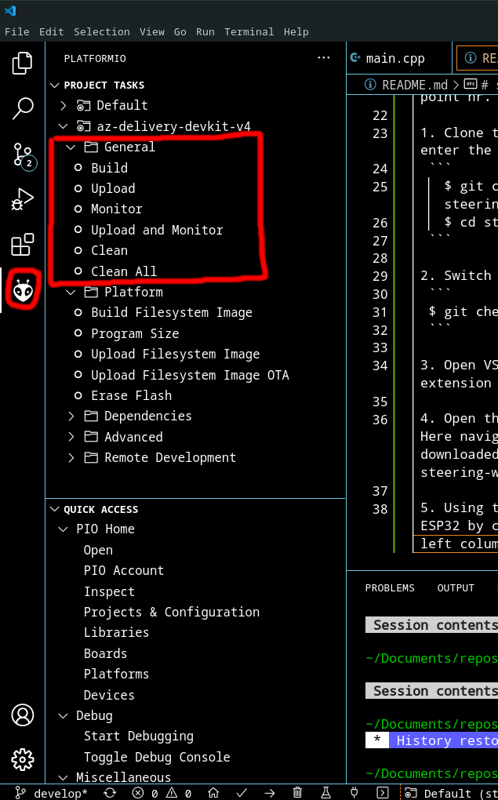

# Steering wheel project
This is a project for a steering wheel for a solar powered car. This steering wheel will be able to show multiple continously updated variables about the car and is built for the possibility of using a menu that could be used to extent its functionality. This repo is only for the software part of the steering wheel.

## Status of project
At this moment this is only a functional prototype and all the functional code is located in the "develop" branch.

## Hardware and software used
The hardware used for the important parts for the project is 
 - ESP32-DevKitC V4
 - 128x64 px monochromic Oled display with SSD1309 driver
 - CJMCU-2551 (CAN-bus tranciver)

The software used:
 - ESP-IDF's Arduino framework
 - ESP-IDF's library?
 - [Adafruit_SSD1306](https://github.com/adafruit/Adafruit_SSD1306)
 - Visual Studio Code
 - PlatformIO

 ## Getting it running
 This asumes that you have all the nessecary hardware and VSCode installed. This hould work on both Linux and Windows. If you do not have git installet on your computer you can either install git or download the develop branch from the repository and start from point nr. 3.

 1. Clone the repository to your local computer and enter the reppository.
  ```
    $ git clone git@github.com:CodeCalle/steering-wheel-project.git
    $ cd steering-wheel-project
  ```
 
 2. Switch branch to "develop"
  ```
  $ git checkout develop
  ```

 3. Open VSCode and install PlatformIO through VScodes extension tab.

 4. Open the project by going to file -> Open folder. Here navigate to the folder where you cloned/downloaded the project and select the steering-wheel-project folder, then click open folder.

 5. Using the PlatformIO extension build and flash the ESP32 by clicking the PlatformIO Icon in the furthest left column and then press "Upload and Monitor" to build, flash and monitor to the ESP32.

